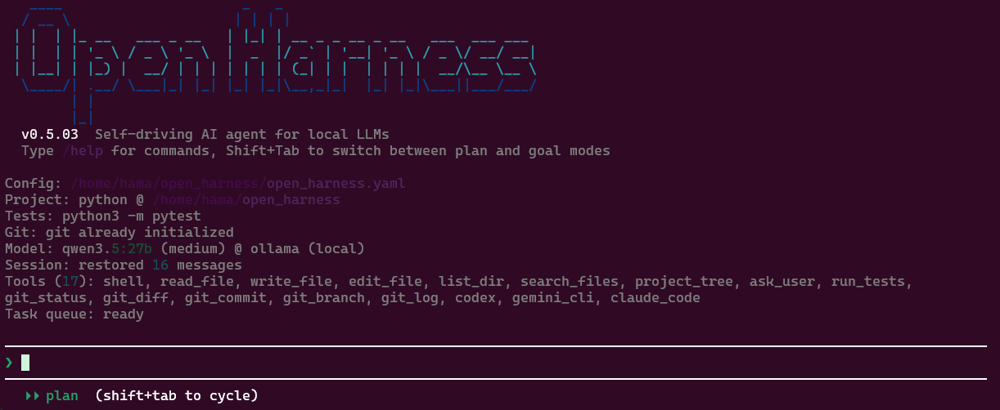

# Open Harness

Self-driving AI agent harness optimized for local LLMs.



## Features

- **Local LLM First** — Designed for LM Studio, Ollama, and any OpenAI-compatible API
- **Weak Model Compensation** — Error-class-specific retry strategies with fuzzy tool matching and JSON repair
- **Multi-Model Routing** — Route tasks to small/medium/large tiers based on complexity
- **Autonomous Goal Execution** — Planner-Critic-Executor loop with complexity-adaptive planning
- **Checkpoint & Rollback** — Git-based transactional safety for autonomous operations
- **Background Task Queue** — Submit goals to a FIFO queue, keep working while they execute
- **Project Memory** — Learns project patterns across sessions (test commands, error fixes, workflows)
- **Policy Guardrails** — Configurable safety limits (safe / balanced / full presets)
- **Orchestrator Architecture** — Local LLM plans and coordinates; external agents (Claude Code, Codex, Gemini CLI) handle code generation and analysis
- **TUI Dashboard** — Rich terminal UI (`--tui`) with split panes, plan progress bar, input history, multiline editing, dark/light theme, and real-time stats
- **15 Built-in Tools** — File ops, shell, git, testing, and external agent delegation (Claude Code, Codex, Gemini CLI)
- **Per-Project Config** — Place `open_harness.yaml` in any directory to customize per-project
- **Performance Optimized** — Adaptive context management, tool output truncation, and system prompt compression for ~40-60% token reduction

## Quick Start

```bash
git clone https://github.com/hama-jp/open_harness.git
cd open_harness
uv venv && source .venv/bin/activate
uv pip install -e .
```

Edit `open_harness.yaml` to point to your LLM server, then:

```bash
harness
```

## Usage

```bash
# Interactive CLI mode
harness

# TUI dashboard mode
harness --tui

# Run a goal non-interactively
harness --goal "Fix the failing tests"

# Use a specific model tier
harness --tier large

# Custom config path
harness --config ~/myproject/open_harness.yaml
```

> Install the TUI extra: `uv pip install -e ".[tui]"`

### REPL commands

```
/goal <task>       Autonomous execution with planning and checkpoints
/submit <task>     Submit to background queue
/tasks             List background tasks
/result <id>       Show task result
/model [tier]      Show model details for all tiers, or switch tier
/tier [name]       Switch model tier (small/medium/large)
/policy [mode]     Switch safety policy (safe/balanced/full)
/tools             List available tools
/memory            Show learned project knowledge
/help              Show all commands
```

## Configuration

Create `open_harness.yaml` in your project directory or `~/.open_harness/`:

```yaml
llm:
  default_provider: "lm_studio"
  providers:
    lm_studio:
      base_url: "http://localhost:1234/v1"
      api_key: "lm-studio"
  models:
    medium:
      provider: "lm_studio"
      model: "your-model-name"
      max_tokens: 8192
  default_tier: "medium"
```

## What's New in v0.5.0

**Performance improvements targeting ~40-60% token reduction for local LLMs:**

- **Complexity-adaptive planning** — Goal complexity (Low/Medium/High) is auto-estimated; plan steps (3-8), agent budget (8-15), and replan depth (0-2) adjust accordingly
- **Adaptive context management** — Two-level compression (L1 tool pair summaries → L2 aggregate counts) with dynamic trim thresholds based on model context length
- **Context summarization** — Structured summaries (files modified, test results, errors) are preserved when messages are trimmed, reducing re-discovery tool calls
- **Error-class-specific retries** — Failures are classified (`malformed_json`, `wrong_tool_name`, `missing_args`, `empty_response`, `prose_wrapped`) for targeted recovery without unnecessary LLM retries
- **Schema-first tool call parsing** — Pre-compiled regex from registered tool names for faster JSON extraction
- **Per-tool output truncation** — Intelligent head+tail truncation with per-tool limits (read_file: 8K, shell: 3K, tests: 4K)
- **System prompt compression** — Tier-specific prompt optimization; small models get minimal prompts
- **Optimized checkpoints** — Snapshots every 10 writes (was 5), fast no-change detection via `git diff --quiet`
- **TUI dashboard** — Two-pane Textual UI with sidebar (history, plan, queue, agents, tasks, stats), draggable resize, sub-agent streaming panel, plan step progress bar, multiline input (Shift+Enter), input history navigation (Up/Down), compact/expand tool output (Ctrl+E), dark/light theme (Ctrl+D), real-time elapsed time, toast notifications, and Escape to cancel

## Documentation

- [Tutorial (English)](docs/tutorial.md)
- [チュートリアル（日本語）](docs/tutorial_ja.md)

## Requirements

- Python 3.11+
- A local LLM server (LM Studio, Ollama, or any OpenAI-compatible endpoint)

## License

MIT
